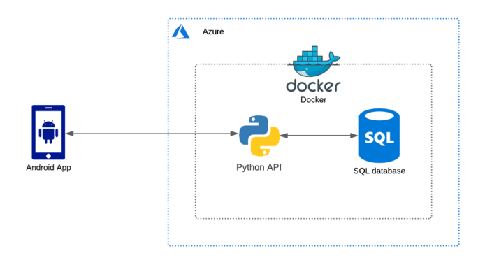

## brunel-fyp

This project was completed as part of the final year project module of BSc Computer Science at Brunel University London. The dissertation is titled "A Smartphone Application to Encourage Recycling" and was supervised by [Professor Rob Macredie](https://www.brunel.ac.uk/people/robert-macredie).

I used Android Studio to develop a smartphone application, and the Flask framework to create a RESTful API - this contains an image classifier and communicates with a database. Docker was used to deploy the API and database within an isolated container - this was stored within a Microsoft Azure server, which provides a public IP address that the Android app can connect to.

The architecture can be seen below:



`setup.sh` can be used to install dependencies on an Azure server, if necessary.

Following that, enter the `server` directory and build the container using the command `docker-compose up --build`.

The app needs the server's IP address - you can find this out using a command such as `ifconfig` and add it to `/android/app/src/main/assets/env`, like so:
```
SERVER_ADDRESS=127.0.0.1
```

As I was using version control, I wanted to prevent future commits to the `env` file, so I used this command: In order to prevent future commits to the `env` file, use this command:
```
git update-index --skip-worktree android/app/src/main/assets/env
```

Now you can install the app on your phone, or use the emulator in Android Studio.

If you want to observe the database, you can enter the container and open up a shell instance:
```
docker exec -it api /bin/bash
flask shell 
```

You can then run database queries (like below, where we look at all users and filter for a specific one):
```
User.query.all()
user = Usery.query.filter_by(username="Amrit").first()
```

A set of tests can also be run in the container, using `python tests.py`.

### Notes
* [dotenv-java](https://github.com/cdimascio/dotenv-java) used to load environment variables in Android Studio.
* [android-async-http](https://loopj.com/android-async-http/) used for API calls.
* [Flask-JWT-Extended](https://flask-jwt-extended.readthedocs.io/en/stable/) used for API token-based authentication.
* [Flask-Testing](https://pythonhosted.org/Flask-Testing/) used for API tests.
* [Kaggle image dataset](https://www.kaggle.com/piaoya/plastic-recycling-codes) used when training the classifier.
